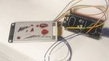
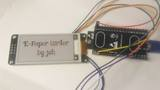
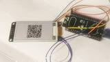
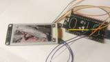

# ePaper writer

## Introduction

This ESP32 Arduino sketch lets you write images, text, and QR-Codes to your e-paper display from a browser-based interface.

* Draw images with very basic drawing operations and upload it to your e-paper display or save it to the ESP32's internal flash memory.
* Enter text with very basic markup for color, alignment, spacing, and fonts, and upload it for rendering on the e-paper display.
* Create QR-codes for display on the e-paper display.
* Select PNG images from your local device and save them to flash memory.
* Manage saved images in the ESP32's flash memory (show in browser, upload to e-paper display, download to PC, delete)

    

## Requirements

* ESP32 with SPIFFS flash partition (ESP8266s might work too)
* 3-color e-paper module (2-color might work too)

Written and to date exclusively tested for the WeAct-EpaperModule-2.13 with 250x122 pixels.

## Usage

1. Install these Arduino libraries: ESPAsyncWebServer, GxEPD2, PNGdec, U8g2_for_Adafruit_GFX, qrcode
2. Important: the qrcode library has a naming conflict with a qrcode.h from the ESP32 core. Follow [these instructions](https://github.com/ricmoo/QRCode/issues/35#issuecomment-1179311130) to solve the conflict. You will need to restart the Arduino IDE afterwards.
3. Make sure you have a working SPIFFS partition on your device. Run the examples from the SPIFFS folder if in doubt.
4. Connect your e-paper to your ESP32 and make sure it works as expected by running the GxEPD2 GFX examples.
5. Load the sketch and adapt the config section at the top of the source code with your e-paper configuration, Wifi credentials, and preferred fonts. *Note*: some newer u8g2 fonts need an updated U8g2_for_Adafruit_GFX.h, see source code for details.
6. Upload the sketch to your ESP32.
7. See the serial monitor for the local URL. Open that in your browser, a tablet might be nicer than a PC for drawing.
8. Start playing around, most things should be self-explanatory.

## Additional info

* **Upload** = upload to e-paper; **Save** = save to ESP32 flash memory; **Download** = download from flash to local device
* **Images** from you local device must be in PNG format and should reflect the dimensions *and* orientation of your e-paper module. If they don't, you might encounter crashes.
* For the **PNG image upload**, you can choose between two algorithms. Choose *nearest* for two- or three-color images. Use *dithered* for multicolor images. Use the sliders to adjust the thresholds for brightness and redness.
* The **draw on canvas** comes with no undo, but you can use the save button frequently if your flash memory is not too full yet, take care, though, existing files will be overwritten and saving might take a bit.
* **QR-Code** mode will be chosen automatically between numeric, alphanumeric, and byte depending on your input. Choose QR-code size and pixel size with care, the code will not check if the QR will fit ony your screen.
* A note on RAM: It might be that ESP32 RAM will be a natural limit for supported e-paper dimensions. I only tested my 250x122 3-color module. If things don't work as expected, watch the serial monitor for crash reports.
* This also applies for QR-code creation, up to 121x121 it worked fine for me without crashing.

## Author

(c) 2025 juh

Includes MIT licenced code by [J-M-L Jackson from the Arduino Forum](
https://forum.arduino.cc/t/uploading-various-byte-streams-to-an-esp32-using-espasncwebserver/1233455)

I heavily extended it with e-paper uploads, QR-code upload, PNG file management and more with many code snippets elicited by my natural and fully biodegradable intelligence from the GPT 4o ai model.

Warning: The current state of this is "it works for me", not more. The result looks good to me, but the code reflects little planning and structure in the development process, it needs a lot of cleanup, streamlining, and optimization.

I haven't decided yet how much effort I will want to spend on this in the futore.
So, as the license says, "provided as is"

## License

This program is free software; you can redistribute it and/or
modify it under the terms of the [GNU General Public License as
published by the Free Software Foundation, version 2](https://www.gnu.de/documents/gpl-2.0.en.html).

Includes MIT licenced code by J-M-L Jackson, see source for their original MIT license.